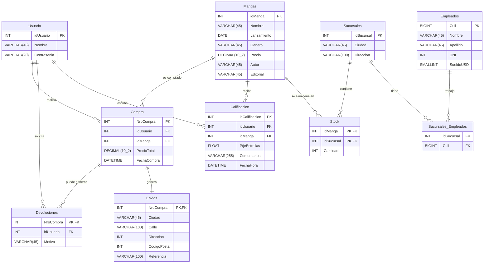

# 📚 BD_Mangas

Este proyecto implementa una base de datos para la gestión de una tienda de mangas, contemplando usuarios, compras, calificaciones, empleados, sucursales, stock y envíos.

🗂️ Estructura de la Base de Datos

La base de datos se llama BD_Mangas y contiene las siguientes tablas principales:

Usuario: Registro de clientes con sus credenciales (contraseña encriptada con SHA2).

Mangas: Catálogo de mangas disponibles con datos como nombre, lanzamiento, género, precio, autor y editorial.

Compra: Historial de compras realizadas por los usuarios.

Devoluciones: Registro de devoluciones con su motivo.

Calificacion: Opiniones y puntajes de los usuarios sobre los mangas (del 1 al 5).

Sucursales: Locales de la tienda con su ciudad y dirección.

Empleados: Información de los empleados (nombre, puesto, sueldo, etc.).

Sucursales_Empleados: Relación entre empleados y sucursales.

Stock: Cantidad de mangas disponibles en cada sucursal.

Envios: Información sobre envíos de compras a domicilio (estado, fecha de envío y entrega).

# Relación Entidad

